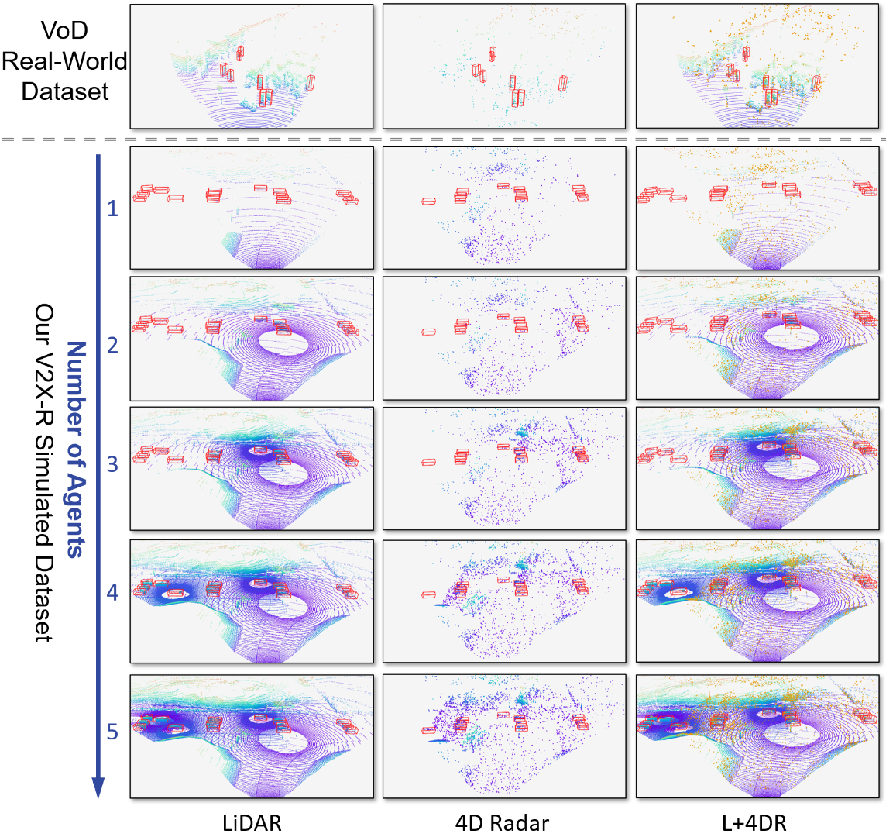

# 点云智能大赛- 赛道六：激光雷达-毫米波雷达融合的协同感知任务

<font color=#0099ff> **Note: The code submission address has been updated to:  [https://www.codabench.org/competitions/9974](https://www.codabench.org/competitions/9974)** </font>


## :balloon: V2X-R Dataset Manual 
The first V2X dataset incorporates LiDAR, camera, and **4D radar**. V2X-R contains **12,079 scenarios** with **37,727 frames of LiDAR and 4D radar point clouds**, **150,908 images**, and **170,859 annotated 3D vehicle bounding boxes**.
<div align="center">
  
</div>


### Data Download and Decompression
[Here](https://huggingface.co/datasets/hx24/V2X-R_Challenge2025) for downloading V2X-Rdataset (huggingface).


Since the data is large (including 3xLiDAR{normal, fog, snow}, 1xradar, 4ximages for each agent). We have compressed the sequence data of each agent, you can refer to this code for batch decompression after downloading.
```python
import os
import subprocess
from concurrent.futures import ThreadPoolExecutor

def process_file(args):
    root, file, save_dir = args
    file_path = os.path.join(root, file)
    path_parts = os.path.normpath(root).split(os.sep)
    if len(path_parts) >= 2:
        extract_path = os.path.join(save_dir, path_parts[-2], path_parts[-1])
    else:
        extract_path = os.path.join(save_dir, os.path.basename(root))
    
    os.makedirs(extract_path, exist_ok=True)
    subprocess.run(['7z', 'x', '-o' + extract_path + '/', file_path], check=True)

def decompress_v2x_r(root_dir, save_dir):
    args_list = []
    for root, dirs, files in os.walk(root_dir):
        for file in files:
            if file.endswith('.7z'):
                args_list.append((root, file, save_dir))
    
    # 创建线程池，max_workers可调整（建议设置为CPU核心数*2）
    with ThreadPoolExecutor(max_workers=os.cpu_count() * 2) as executor:
        executor.map(process_file, args_list)

if __name__ == "__main__":
    data_directory = #TO DO, e.g: '/mnt/16THDD-2/hx/V2X-R_Dataset_test_Challenge2025'
    output_directory = #TO DO, e.g: '/mnt/16THDD-2/hx/V2X-R_Dataset_test_Challenge2025_decompress'
    decompress_v2x_r(data_directory, output_directory)
```

### Data Structure
:open_file_folder: After download and decompression are finished, the dataset is structured as following:

```sh
V2X-R # root path of v2x-r output_directory 
├── train
│   ├──Sequence name (time of data collection, e.g. 2024_06_24_20_24_02)
│   │   ├──Agent Number ("-1" denotes infrastructure, otherwise is CAVs)
│   │   │   ├──Data (including the following types of data)
│   │   │   │ Timestamp.Type, eg.
│   │   │   │ - 000060.pcd (LiDAR),
│   │   │   │ - 000060_radar.pcd (4D radar),
│   │   │   │ - 000060.yaml (meta-data)
├── validate
│   ├──...
├── test
│   ├──Sequence name (time of data collection, e.g. 2024_06_24_20_24_02)
│   │   ├──Agent Number ("-1" denotes infrastructure, otherwise is CAVs)
│   │   │   ├──Data (including the following types of data)
│   │   │   │ Timestamp.Type, eg.
│   │   │   │ - 000060.pcd (LiDAR),
│   │   │   │ - 000060_radar.pcd (4D radar), 
│   │   │   │ - 000060.yaml (meta-data without gt_boxes)

```

### Calibration
We provide calibration information for each sensor (LiDAR, 4D radar, camera) of each agent for inter-sensor fusion. In particular, the exported 4D radar point cloud has been converted to the LiDAR coordinate system of the corresponding agent in advance of fusion, so the 4D radar point cloud is referenced to the LiDAR coordinate system.


## :balloon: Quickly Get Started

### Installation
Refer to [Installation of V2X-R](INSTALL.md)


### Train benchmark model 
First of all, modify the dataset path in the setting file (**root_dir**, **validate_dir**), i.e. `xxx.yaml`.

The setting is same as OpenCOOD, which uses yaml file to configure all the parameters for training. To train your own model from scratch or a continued checkpoint, run the following commonds:
```python
training command --hypes_yaml ${CONFIG_FILE} [--model_dir  ${CHECKPOINT_FOLDER}] [--tag  ${train_tag}] [--worker  ${number}]
```
Arguments Explanation:
- `hypes_yaml`: the path of the training configuration file, e.g. `opencood/hypes_yaml/second_early_fusion.yaml`, meaning you want to train
an early fusion model which utilizes SECOND as the backbone. See [Tutorial 1: Config System](https://opencood.readthedocs.io/en/latest/md_files/config_tutorial.html) to learn more about the rules of the yaml files.
- `model_dir` (optional) : the path of the checkpoints. This is used to fine-tune the trained models. When the `model_dir` is given, the trainer will discard the `hypes_yaml` and load the `config.yaml` in the checkpoint folder.
- `tag` (optional) : the path of the checkpoints. The training label is used to record additional information about the model being trained, with the default setting being 'default'.
- `worker` (optional) : the number of workers in dataloader, default is 16.


### Training
For example, to train V2XR_AttFuse (LiDAR-4D radar fusion version) from scratch:
```
CUDA_VISIBLE_DEVICES=0 python opencood/tools/train.py --hypes_yaml opencood/hypes_yaml/V2X-R/L_4DR_Fusion/V2XR_AttFuse.yaml --tag 'demo' --worker 16
```

To train V2XR_AttFuse from a checkpoint:
```
CUDA_VISIBLE_DEVICES=0 python opencood/tools/train.py --hypes_yaml opencood/hypes_yaml/V2X-R/L_4DR_Fusion/V2XR_AttFuse.yaml --model_dir opencood/logs/V2XR_AttFuse/test__2024_11_21_16_40_38 --tag 'demo' --worker 16
```

To train V2XR_AttFuse with 4 GPUs:
```
CUDA_VISIBLE_DEVICES=0,1,2,3 python -m torch.distributed.launch --nproc_per_node=4  --use_env opencood/tools/train.py --hypes_yaml opencood/hypes_yaml/V2X-R/L_4DR_Fusion/V2XR_AttFuse.yaml --tag 'demo' --worker 16
```


### Validation

Before validating, modify the `validation_dir` to `validate_path` in config.yaml

```python
python opencood/tools/inference.py --model_dir ${CHECKPOINT_FOLDER} --eval_epoch ${epoch_number} --test_eval
```
Arguments Explanation:
- `model_dir`: the path to your saved model.
- `eval_epoch`: int. Choose to inferece which epoch.

For example, to test V2XR_AttFuse (LiDAR-4D radar fusion version) from scratch:
```
CUDA_VISIBLE_DEVICES=0 python opencood/tools/inference.py --model_dir opencood/logs/V2XR_AttFuse/test__2024_11_21_16_40_38 --eval_epoch 30
```


### Testing and Submission

Before testing, modify the `validation_dir` to `test_path` in config.yaml under your checkpoint folder and setup `test_eval`

```python
python opencood/tools/inference.py --model_dir ${CHECKPOINT_FOLDER} --eval_epoch ${epoch_number} --test_eval
```
Arguments Explanation:
- `model_dir`: the path to your saved model.
- `eval_epoch`: int. Choose to inferece which epoch.
- `test_eval`: bool. Saving the results to submit.

For example, to test V2XR_AttFuse (LiDAR-4D radar fusion version) from scratch:
```
CUDA_VISIBLE_DEVICES=0 python opencood/tools/inference.py --model_dir opencood/logs/V2XR_AttFuse/test__2024_11_21_16_40_38 --eval_epoch 30  --test_eval
```
The Inference results will be dumped in the model directory as `pred.pkl`, then you can submit this file to our benchmark. (Please do not to modify saved data structure.)


## :balloon: Benchmark and Models Zoo

### Introduction
All benchmark model can be downloaded in [here](https://huggingface.co/hx24/V2X-R_Benchmark/tree/main).


If you need to run the following pre trained models:
1. Download the corresponding pre-trained model to **folder A** and **rename it as 0.pth**
2. Copy the corresponding configuration file to folder A and **rename it as config.yaml**
3. Run the command according to the "Test the model" section, with the parameter *--model_dir A --eval_ epoch 0*
4. Modify evalsim in the configuration file to test the results under different simulated weather conditions
5. *Please note: Due to code version switching, there may be slight differences between the reproduced results and the reported accuracy. It is recommended to use the reproduced results as the standard. If you find that the difference is unacceptable, there may be some problem, please raise an issue.*

### 4DRadar-based Cooperative 3D Detector (no-compression)
| **Method** | **Validation (IoU=0.3/0.5/0.7)** | **Testing (IoU=0.3/0.5/0.7)** | **Config** |  **Model**  |
|:--------------------------------:|:--------------------------------:|:-----------------------------:|:----------:|:-----------:|
|         [ITSC2021:PFA-Net](https://ieeexplore.ieee.org/abstract/document/9564754)         |         75.45/66.66/38.30        |       84.93/79.71/52.46       |      [√](opencood/hypes_yaml/V2X-R/4DRadar/V2XR_PFA_net.yaml)     | [model-25M](http://39.98.109.195:1000/files/V2X-R_Dataset(compressed)/benchmark/radar) |
|           [NIPS2022:RTNH](https://arxiv.org/abs/2206.08171)          |         72.00/62.54/34.65        |       73.61/67.63/41.86       |      [√](opencood/hypes_yaml/V2X-R/4DRadar/V2XR_RTNH.yaml)     | [model-64M](http://39.98.109.195:1000/files/V2X-R_Dataset(compressed)/benchmark/radar) |
|          [ECCV2022:V2XViT](https://arxiv.org/abs/2203.10638)         |         68.58/61.88/29.47        |       80.61/73.52/42.60       |      [√](opencood/hypes_yaml/V2X-R/4DRadar/V2XR_v2xvit.yaml)     | [model-51M](http://39.98.109.195:1000/files/V2X-R_Dataset(compressed)/benchmark/radar) |
|         [ICRA2022:AttFuse](https://arxiv.org/abs/2109.07644)         |         71.83/63.33/34.15        |       81.34/74.98/47.96       |      [√](opencood/hypes_yaml/V2X-R/4DRadar/V2XR_attfuse.yaml)     | [model-25M](http://39.98.109.195:1000/files/V2X-R_Dataset(compressed)/benchmark/radar) |
|        [NIPS2023:Where2comm](https://arxiv.org/abs/2209.12836)       |         68.99/56.55/25.59        |       79.21/72.88/36.15       |      [√](opencood/hypes_yaml/V2X-R/4DRadar/V2XR_where2comm.yaml)     | [model-30M](http://39.98.109.195:1000/files/V2X-R_Dataset(compressed)/benchmark/radar) |
|          [ICCV2023:SCOPE](https://openaccess.thecvf.com/content/ICCV2023/html/Yang_Spatio-Temporal_Domain_Awareness_for_Multi-Agent_Collaborative_Perception_ICCV_2023_paper.html)          |         61.90/59.30/47.90        |       73.00/71.60/51.60       |      [√](opencood/hypes_yaml/V2X-R/4DRadar/V2XR_scope.yaml)     | [model-151M](http://39.98.109.195:1000/files/V2X-R_Dataset(compressed)/benchmark/radar) |
|          [CoRL2023:CoBEVT](https://arxiv.org/abs/2207.02202)         |         73.48/66.82/34.48        |       85.74/80.64/54.34       |      [√](opencood/hypes_yaml/V2X-R/4DRadar/V2XR_cobevt.yaml)     | [model-40M](http://39.98.109.195:1000/files/V2X-R_Dataset(compressed)/benchmark/radar) |
|         [ICRA2023:CoAlign](https://arxiv.org/abs/2211.07214)         |         75.05/68.11/41.20        |       81.69/75.74/52.01       |      [√](opencood/hypes_yaml/V2X-R/4DRadar/V2XR_coalign.yaml)     | [model-43M](http://39.98.109.195:1000/files/V2X-R_Dataset(compressed)/benchmark/radar) |
|        [WACV2023:AdaFusion](https://openaccess.thecvf.com/content/WACV2023/html/Qiao_Adaptive_Feature_Fusion_for_Cooperative_Perception_Using_LiDAR_Point_Clouds_WACV_2023_paper.html)        |        75.60/70.33/41.11        |       81.95/77.84/55.32       |      [√](opencood/hypes_yaml/V2X-R/4DRadar/V2XR_adafusion.yaml)     | [model-27M](http://39.98.109.195:1000/files/V2X-R_Dataset(compressed)/benchmark/radar) |
|           [IROS2024:SICP](https://arxiv.org/abs/2312.04822)          |         70.83/62.79/34.82        |       71.94/65.17/63.44       |      [√](opencood/hypes_yaml/V2X-R/4DRadar/V2XR_sicp.yaml)     | [model-28M](http://39.98.109.195:1000/files/V2X-R_Dataset(compressed)/benchmark/radar) |

### LiDAR-based Cooperative 3D Detector (no-compression)
| **Method** | **Validation (IoU=0.3/0.5/0.7)** | **Testing (IoU=0.3/0.5/0.7)** | **Config** |  **Model**  |
|:------------------------------:|:--------------------------------:|:-----------------------------:|:----------:|:-----------:|
| [ECCV2022:V2XViT](https://arxiv.org/abs/2203.10638)                | 83.47/80.65/63.48                | 89.44/88.40/77.13             |      [√](opencood/hypes_yaml/V2X-R/LiDAR/V2XR_v2xvit.yaml)     | [model-52M](http://39.98.109.195:1000/files/V2X-R_Dataset(compressed)/benchmark/lidar) |
| [ICRA2022:AttFuse](https://arxiv.org/abs/2109.07644)               | 86.69/82.58/66.56                | 91.21/89.51/80.01             |      [√](opencood/hypes_yaml/V2X-R/LiDAR/V2XR_attfuse.yaml)     | [model-25M](http://39.98.109.195:1000/files/V2X-R_Dataset(compressed)/benchmark/lidar) |
| [NIPS2023:Where2comm](https://arxiv.org/abs/2209.12836)         | 85.31/82.65/64.35                  | 85.59/84.27/73.13             |      [√](opencood/hypes_yaml/V2X-R/LiDAR/V2XR_where2comm.yaml)     | [model-30M](http://39.98.109.195:1000/files/V2X-R_Dataset(compressed)/benchmark/lidar) |
| [ICCV2023:SCOPE](https://openaccess.thecvf.com/content/ICCV2023/html/Yang_Spatio-Temporal_Domain_Awareness_for_Multi-Agent_Collaborative_Perception_ICCV_2023_paper.html)                 | 79.43/77.35/65.08                | 81.40/72.90/67.00             |      [√](opencood/hypes_yaml/V2X-R/LiDAR/V2XR_scope.yaml)     | [model-151M](http://39.98.109.195:1000/files/V2X-R_Dataset(compressed)/benchmark/lidar) |
| [CoRL2023:CoBEVT](https://arxiv.org/abs/2207.02202)                | 86.65/84.59/70.30                | 91.41/90.44/81.06             |      [√](opencood/hypes_yaml/V2X-R/LiDAR/V2XR_cobevt.yaml)     | [model-40M](http://39.98.109.195:1000/files/V2X-R_Dataset(compressed)/benchmark/lidar) |
| [ICRA2023:CoAlign](https://arxiv.org/abs/2211.07214)               | 84.43/82.29/70.68                | 88.12/86.99/80.05             |      [√](opencood/hypes_yaml/V2X-R/LiDAR/V2XR_coalign.yaml)     | [model-43M](http://39.98.109.195:1000/files/V2X-R_Dataset(compressed)/benchmark/lidar) |
| [ICCV:AdaFusion](https://openaccess.thecvf.com/content/WACV2023/html/Qiao_Adaptive_Feature_Fusion_for_Cooperative_Perception_Using_LiDAR_Point_Clouds_WACV_2023_paper.html)                 | 88.19/86.96/75.55                | 92.72/91.64/84.81             |      [√](opencood/hypes_yaml/V2X-R/LiDAR/V2XR_adafusion.yaml)     | [model-27M](http://39.98.109.195:1000/files/V2X-R_Dataset(compressed)/benchmark/lidar) |
| [IROS2024:SICP](https://arxiv.org/abs/2312.04822)                  | 81.08/77.56/58.10                | 84.65/82.18/66.73             |      [√](opencood/hypes_yaml/V2X-R/LiDAR/V2XR_sicp.yaml)     | [model-28M](http://39.98.109.195:1000/files/V2X-R_Dataset(compressed)/benchmark/lidar) |


### LiDAR-4D Radar Fusion Cooperative 3D Detector (no-compression)
|       **Method**       | **Validation (IoU=0.3/0.5/0.7)** | **Testing (IoU=0.3/0.5/0.7)** | **Config** |  **Model**  |
|:----------------------:|:--------------------------------:|:-----------------------------:|:----------:|:-----------:|
|  [IROS2023:InterFusion](https://ieeexplore.ieee.org/document/9982123)  |         78.33/74.70/51.44        |       87.91/86.51/69.63       |      [√](opencood/hypes_yaml/V2X-R/L_4DR_Fusion/V2XR_InterFusion.yaml)     | [model-95M](http://39.98.109.195:1000/files/V2X-R_Dataset(compressed)/benchmark/l+r) |
|     [Arxiv2024:L4DR](https://arxiv.org/abs/2408.03677)     |         80.91/79.00/67.17        |       90.01/88.85/82.26       |      [√](opencood/hypes_yaml/V2X-R/L_4DR_Fusion/V2XR_L4DR.yaml)     | [model-79M](http://39.98.109.195:1000/files/V2X-R_Dataset(compressed)/benchmark/l+r) |
|    [ICRA2022:AttFuse](https://arxiv.org/abs/2109.07644)    |         83.45/81.47/69.11        |       91.50/90.04/82.44       |      [√](opencood/hypes_yaml/V2X-R/L_4DR_Fusion/V2XR_AttFuse.yaml)     | [model-95M](http://39.98.109.195:1000/files/V2X-R_Dataset(compressed)/benchmark/l+r) |
|     [ECCV2022:V2XViT](https://arxiv.org/abs/2203.10638)    |         85.43/83.32/66.23        |       91.21/90.07/79.87       |[√](opencood/hypes_yaml/V2X-R/L_4DR_Fusion/V2XR_V2XViT.yaml)     | [model-118M](http://39.98.109.195:1000/files/V2X-R_Dataset(compressed)/benchmark/l+r) |
|     [ICCV2023:Scope](https://openaccess.thecvf.com/content/ICCV2023/html/Yang_Spatio-Temporal_Domain_Awareness_for_Multi-Agent_Collaborative_Perception_ICCV_2023_paper.html)     |         78.79/77.96/62.57        |       83.38/82.89/70.00       |      [√](opencood/hypes_yaml/V2X-R/L_4DR_Fusion/V2XR_Scope.yaml)     | [model-134M](http://39.98.109.195:1000/files/V2X-R_Dataset(compressed)/benchmark/l+r) |
| [NIPS2023:Where2comm](https://arxiv.org/abs/2209.12836) |         88.05/85.98/69.94        |       92.20/91.16/81.40       |      [√](opencood/hypes_yaml/V2X-R/L_4DR_Fusion/V2XR_where2comm.yaml)     | [model-30M](http://39.98.109.195:1000/files/V2X-R_Dataset(compressed)/benchmark/l+r) |
|     [CoRL2023:CoBEVT](https://arxiv.org/abs/2207.02202)    |         86.45/85.49/75.65        |       94.23/93.50/86.92       |      [√](opencood/hypes_yaml/V2X-R/L_4DR_Fusion/V2XR_Cobevt.yaml)     | [model-40M](http://39.98.109.195:1000/files/V2X-R_Dataset(compressed)/benchmark/l+r) |
|    [ICRA2023:CoAlign](https://arxiv.org/abs/2211.07214)    |         87.08/85.44/73.66        |       91.13/90.19/83.73       |      [√](opencood/hypes_yaml/V2X-R/L_4DR_Fusion/V2XR_CoAlign.yaml)     | [model-49M](http://39.98.109.195:1000/files/V2X-R_Dataset(compressed)/benchmark/l+r) |
|   [WACV2023:AdaFusion](https://openaccess.thecvf.com/content/WACV2023/html/Qiao_Adaptive_Feature_Fusion_for_Cooperative_Perception_Using_LiDAR_Point_Clouds_WACV_2023_paper.html)   |         88.87/86.94/74.44        |       92.94/91.97/85.31       |      [√](opencood/hypes_yaml/V2X-R/L_4DR_Fusion/V2XR_AdaFusion.yaml)     | [model-27M](http://39.98.109.195:1000/files/V2X-R_Dataset(compressed)/benchmark/l+r) |
|      [IROS2024:SICP](https://arxiv.org/abs/2312.04822)     |         83.32/80.61/63.08        |       84.83/82.59/67.61       |      [√](opencood/hypes_yaml/V2X-R/L_4DR_Fusion/V2XR_Sicp.yaml)     | [model-28M](http://39.98.109.195:1000/files/V2X-R_Dataset(compressed)/benchmark/l+r) |


## Citation
If you are using our project for your research, please cite the following paper:

```
@article{V2X-R,
  title={V2X-R: Cooperative LiDAR-4D Radar Fusion for 3D Object Detection with Denoising Diffusion},
  author={Huang, Xun and Wang, Jinlong and Xia, Qiming and Chen, Siheng and Yang, Bisheng and Wang, Cheng and Wen, Chenglu},
  journal={arXiv preprint arXiv:2411.08402},
  year={2024}
}
```

## Acknowledgements
Thank for the excellent cooperative perception codebases  [BM2CP](https://github.com/byzhaoAI/BM2CP), [OpenCOOD](https://github.com/DerrickXuNu/OpenCOOD), [CoPerception](https://github.com/coperception/coperception) and [Where2comm](https://github.com/MediaBrain-SJTU/Where2comm).

Thank for the excellent cooperative perception dataset [OPV2V](https://mobility-lab.seas.ucla.edu/opv2v/).

Thank for the dataset and code support by [DerrickXu](https://github.com/DerrickXuNu) and [ZhaoAI](https://github.com/byzhaoAI).
